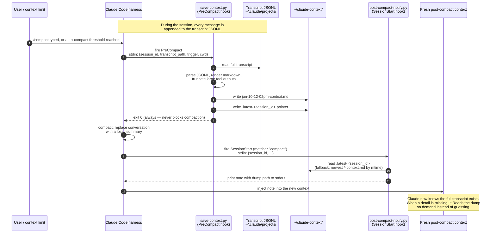
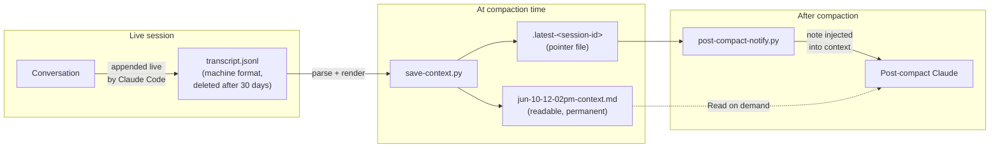

# Architecture

How claude-context-saver works internally, end to end.

## Components

| Component | Location | Role |
|---|---|---|
| Claude Code harness | the CLI itself | Fires hook events at fixed lifecycle points; performs the actual compaction |
| Hook registry | `~/.claude/settings.json` | Declares which script runs on which event (`PreCompact` auto/manual, `SessionStart` compact) |
| Session transcript | `~/.claude/projects/<project>/<session-id>.jsonl` | Append-only machine-format log of every message; written by Claude Code, read by this tool |
| `save-context.py` | `~/.claude/hooks/` | PreCompact hook: converts the transcript JSONL to readable markdown |
| `post-compact-notify.py` | `~/.claude/hooks/` | SessionStart hook: tells the fresh post-compact context where the dump is |
| Dump folder | `~/claude-context/` | Holds timestamped `*-context.md` dumps plus hidden `.latest-<session-id>` pointer files |

Both scripts are plain python3 with no dependencies. The model is never involved
in saving — hooks are deterministic harness-level callbacks, which is why this
works on every compaction with zero per-chat setup.

## Event flow

## Data flow

## save-context.py in detail

1. Reads the hook payload from stdin: `session_id`, `transcript_path`,
   `trigger` (`auto` or `manual`), `cwd`.
2. Streams the transcript JSONL line by line. Each entry has a `type`
   (`user` / `assistant`) and a `message.content` list of blocks.
3. Renders each block:
   - `text` blocks → printed under a `## User` / `## Claude` header with the
     entry timestamp
   - `tool_use` blocks → tool name plus its input as a JSON code block
   - `tool_result` blocks → output, truncated at `MAX_TOOL_CHARS`
     (default 3000) so one giant file read cannot bloat the dump
   - `isMeta` entries and thinking blocks are skipped
4. Writes the dump to `~/claude-context/<mon-dd-hh-mmpm>-context.md`. If that
   name already exists (two compactions in the same minute), a `-2` suffix is
   added — existing files are never overwritten.
5. Writes the dump path into `~/claude-context/.latest-<session_id>`.
6. Exits 0 unconditionally. Any internal error is swallowed: a broken dump
   must never block the user's compaction.

## post-compact-notify.py in detail

1. Reads `session_id` from stdin. The session id is the same before and after
   compaction, which is what makes the pointer-file lookup reliable.
2. Resolves the dump path: first the `.latest-<session_id>` pointer, then a
   fallback to the newest `*-context.md` by mtime.
3. Prints a short note to stdout containing the path and an instruction to
   read the file when details are missing. For `SessionStart` hooks, stdout is
   injected directly into the new context by the harness.

The note is deliberately small (a few lines). The dump itself is only read
when needed — injecting the whole dump would immediately refill the context
that compaction just freed.

## Design decisions

- **Hooks, not MCP.** An MCP server would give the model a tool it must
  *decide* to call; a hook is fired by the harness deterministically, every
  time, with the model uninvolved. Saving must not depend on the model
  remembering to save.
- **Fail-open.** Both scripts exit 0 on every error path. The worst failure
  mode is "no dump", never "compaction blocked".
- **Pointer file per session.** A machine can have several sessions
  compacting near-simultaneously; matching on `session_id` guarantees each
  fresh context is pointed at its own history, with the mtime fallback as a
  safety net.
- **Markdown, not JSONL.** The dump is for two readers: the user, and a
  future Claude using the Read tool. Both handle markdown far better than the
  raw transcript format, and the copy in `~/claude-context/` survives Claude
  Code's 30-day transcript cleanup.
- **Truncated tool output.** Full tool results (whole files, long command
  output) are usually re-derivable from disk; the conversation itself is not.
  3000 chars per result keeps dumps readable and small.
